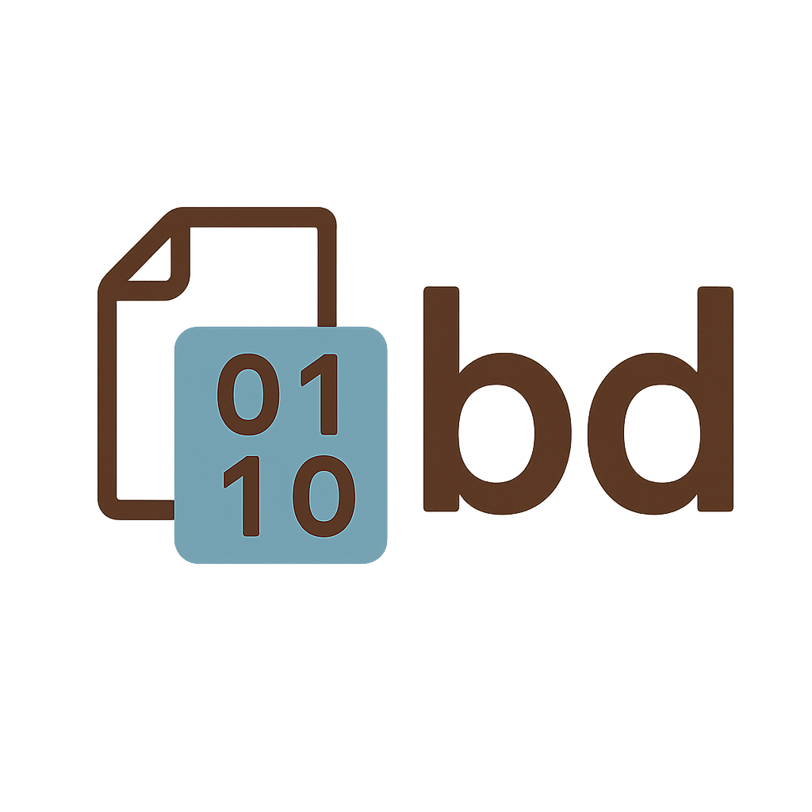

<p align="center">

</p>

# bd - Binary Dependency Manager for Go

`bd` is a simple tool for managing Go binary dependencies. It allows you to specify the required tools, their versions, and target installation directory in a configuration file (`bd.json`).

## Features
- Ensures consistent versions of binaries across environments.
- Installs binaries to a dedicated directory, preventing pollution of global `GOBIN`.
- Supports custom binary names with version suffixes.
- Avoids dependency conflicts often encountered with `tools.go`.
- Provides an easy way to execute installed binaries with `bd exec`.


## Installation

```sh
# Clone the repository and build manually, or install using go install
go install github.com/afansv/bd@latest
```

## Usage

### 1. Define your dependencies in `bd.json`

```json
{
  "binDir": "bin",
  "binaries": [
    { "package": "golang.org/x/tools/cmd/goimports", "version": "latest", "name": "goimports" },
    { "package": "github.com/mgechev/revive", "version": "v1.3.0", "name": "revive" }
  ]
}
```
> **Note:** It is recommended to specify exact versions instead of `latest` to ensure reproducible environments.

Also, you can set Go version for specific package via `toolchain` property:
```json
{
  "binDir": "bin",
  "binaries": [
    {
      "package": "github.com/golangci/golangci-lint/cmd/golangci-lint",
      "version": "v1.63.4",
      "name": "golangci-lint",
      "toolchain": "go1.23.5"
    }
  ]
}
```

### 2. Install binaries
```sh
bd install
```
This will install the specified binaries into `binDir`, appending their versions to the filenames.

> **Note:** You can use `--clean`, `-clean` or `-c` option to clean `binDir` before installing.

### 3. Execute binaries
```sh
bd exec goimports -w main.go
```
If the binary is not found, `bd` will suggest running `bd install` first.

Alternatively, you can run binaries directly from `binDir`:
```sh
./bin/goimports -w main.go
```

## Why use bd?
- Keeps your project’s tooling self-contained, avoiding version conflicts.
- Works without modifying `go.mod` or relying on `tools.go`.
- Ensures team-wide consistency in CI/CD and local development.

## Best Practices
- Store `bd.json` in the repository. It should **not** be added to `.gitignore`.
- The `binDir` directory should be added to `.gitignore` to avoid committing installed binaries.

## License
MIT

